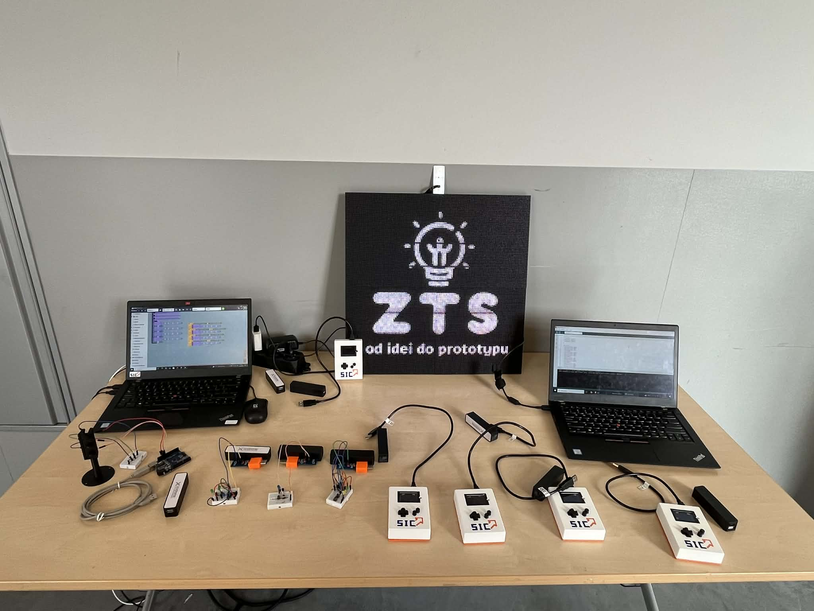

<h1 align="center">Koło Naukowe Zrób To Sam</h1>

  <a href="#english-version">🇬🇧 English version</a>

---

  

Jesteśmy kołem naukowym działającym przy Politechnice Warszawskiej, skupiającym się na praktycznej nauce i realizacji projektów **DIY**. Naszym głównym obszarem działań jest elektronika, druk 3D oraz inne technologie napędzane zainteresowaniami członków. 

Ta organizacja na GitHubie to nasze centralne repozytorium. Służy do wersjonowania, przechowywania i udostępniania kodu źródłowego wykorzystywanego w naszych projektach sprzętowych i edukacyjnych.

### 🛠 Co robimy?
* **Projekty:** Projektowanie i budowa układów elektronicznych, mechaniki oraz oprogramowania (np. systemy wbudowane, aplikacje sterujące).
* **Battlebots:** Budowa robotów turniejowych i organizacja cyklicznych zawodów walk robotów.
* **Warsztaty:** Prowadzenie szkoleń z elektroniki i programowania – zarówno wewnętrznych dla członków, jak i otwartych wydarzeń dla publiczności.

### 🔗 Linki
* [Facebook - KN Zrób To Sam](https://www.facebook.com/kn.zrobtosam)
* [Instagram - kn_zrobmytorazem](https://www.instagram.com/kn_zrobmytorazem)

 

---

<h1 id="english-version" align="center">DIY Student Club</h1>

  

We are a student-run research club at the Warsaw University of Technology, focused on practical learning and building **DIY** projects. Our core activities revolve around electronics, 3D printing, and other technologies driven by our members' passions.

This GitHub organization is our central code repository. It is used for versioning, storing, and sharing the source code that powers our hardware and educational initiatives.

### 🛠 What we do
* **Projects:** Designing and building electronic circuits, mechanical structures, and software (e.g., embedded systems, control applications).
* **Battlebots:** Building combat robots and organizing recurring robot combat events.
* **Workshops:** Hosting electronics and programming training sessions – both internally for members and as open public events.

### 🔗 Links
* [Facebook - KN Zrób To Sam](https://www.facebook.com/kn.zrobtosam)
* [Instagram - kn_zrobmytorazem](https://www.instagram.com/kn_zrobmytorazem)
